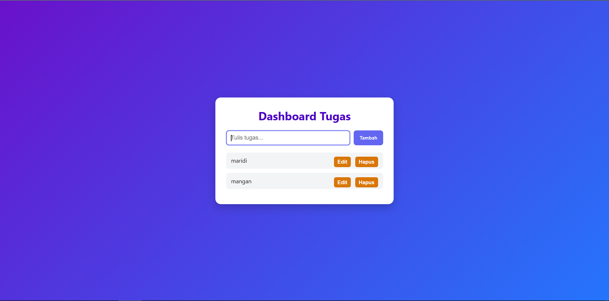
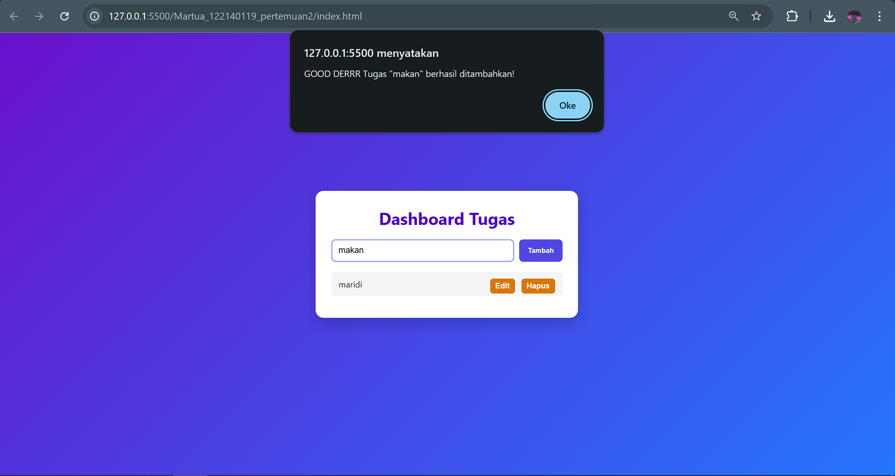
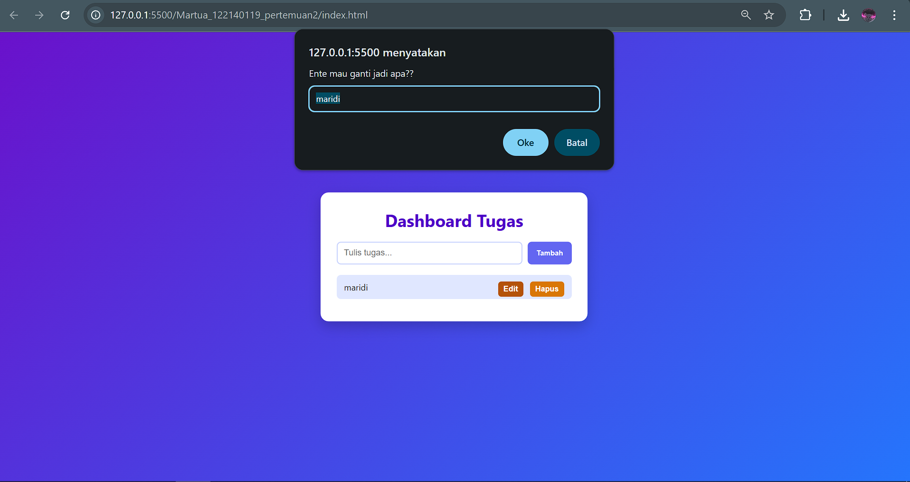
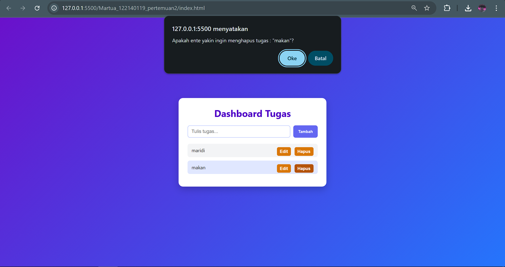

#  Personal Dashboard - Project JavaScript ES6+

Ini adalah aplikasi **Personal Dashboard** sederhana berbasis JavaScript (ES6+) 

##  Fitur Aplikasi

- ✅ Tambah tugas baru
- ✏️ Edit tugas yang sudah ada
- ❌ Hapus tugas dari daftar
- 💾 Penyimpanan data menggunakan `localStorage`
- 💡 Antarmuka responsif dan berwarna dengan gradien modern

## Cara Menjalankan

1. Clone atau download project ini
2. Buka file `index.html` menggunakan browser
3. Aplikasi siap digunakan

##  Struktur Project

project-js-nextgen/
├── css/
│   └── style.css            # Style modern & colorful
├── js/
│   ├── modules/
│   │   ├── data.js          # Class TaskManager (logic utama)
│   │   └── utils.js         # Helper render (template literal)
│   ├── app.js               # Logic tampilan & event listener
│   └── main.js              # Inisialisasi & async load
└── index.html               # Tampilan utama HTML

## Fitur ES6+ yang Diimplementasikan

| Fitur ES6+                 | Implementasi                                                                 |
|---------------------------|------------------------------------------------------------------------------|
| `let` dan `const`         | Digunakan secara konsisten untuk variabel yang berubah dan tetap             |
| Arrow functions `=>`      | Di file `utils.js`, `main.js`, dan beberapa event handler                    |
| Template literals         | Untuk render tugas di DOM dengan `${}` di `createTaskElement()`             |
| Class                     | `TaskManager` di `data.js` untuk pengelolaan data                            |
| Async / Promise           | Simulasi async task loader di `main.js` (`loadInitialTasks()` pakai `Promise`) |

---

## Screenshot Tampilan Aplikasi

## Dibuat oleh
> (Martua Kevin A.M.H.Lubis / 122140119)
