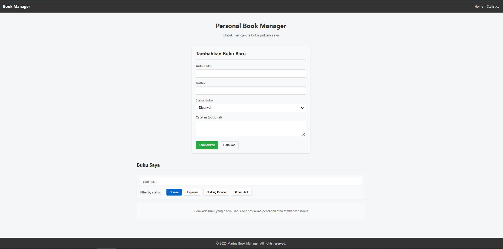
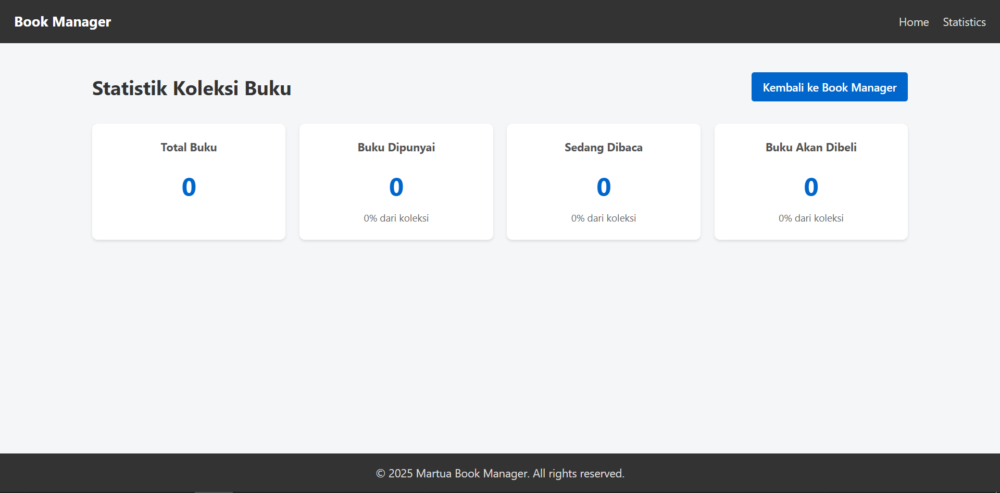
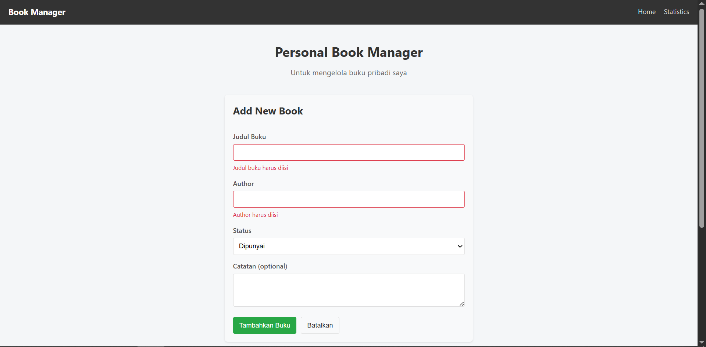
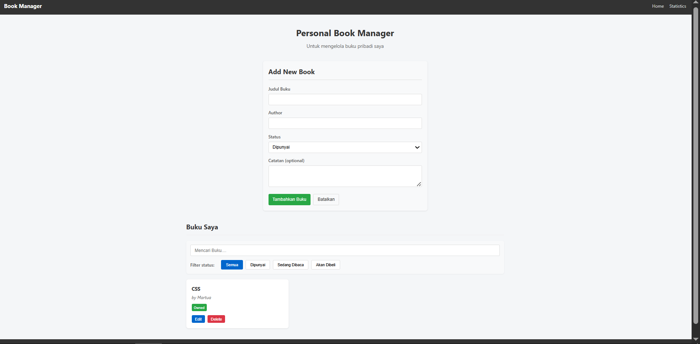
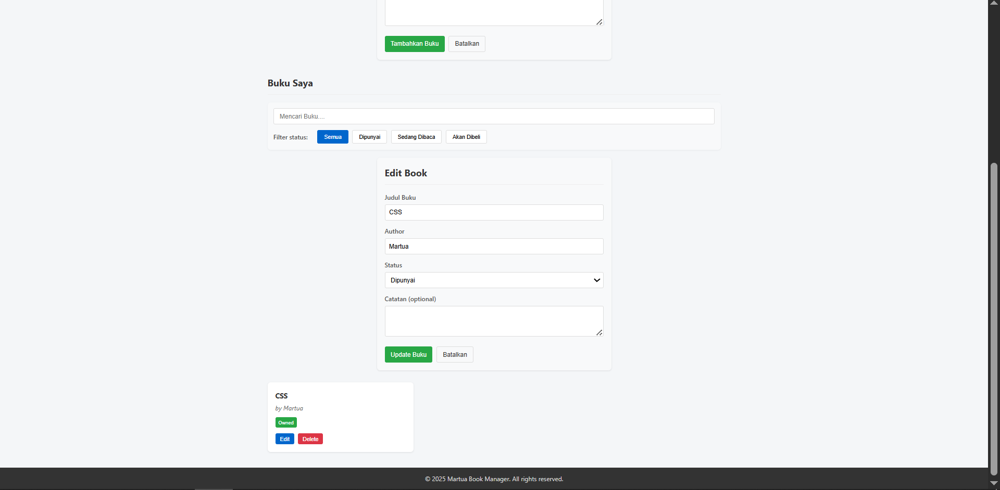
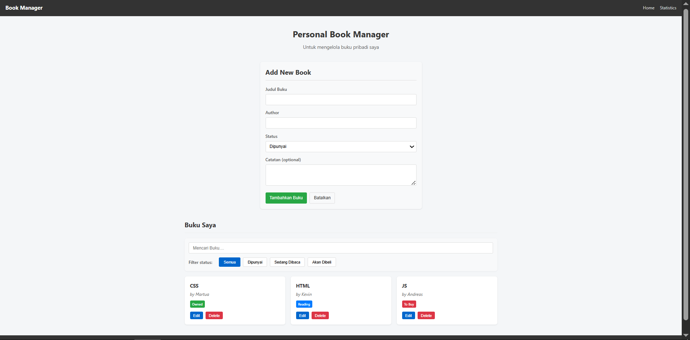
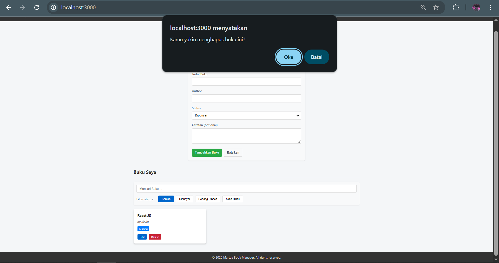

# 📚 MyBook

Aplikasi **MyBook** adalah aplikasi berbasis React yang digunakan untuk mengelola dan melihat statistik buku. Aplikasi ini dibangun menggunakan React Context, custom hooks, dan pemisahan halaman untuk struktur yang lebih modular.

## 📁 Struktur Proyek

mybook/ 
├── node_modules/ 
├── public/ 
├── src/ 
│  ├── component/ 
│  ├── context/ 
│  │   └── BookContext.js
|  ├── hooks/ 
│  │   └── useBookStats.js 
│  │   └── useLocalStorage.js 
│  ├── pages/ 
│  │ ├── Home/ 
│  │ │  └── Home.css 
│  │ │  └── Home.jsx 
│  │ └── Stats/ 
│  │    └── Stats.css 
│  │    └── Stats.jsx 
│  ├── App.css 
│  ├── App.jsx 
│  ├── index.css 
│  ├── index.js 
│  ├── reportWebVitals.js 
│  └── setupTests.js 
├── .gitignore 
├── package-lock.json 
├── package.json 
└── README.md


## 🚀 Fitur Utama

- 📚 **Manajemen Buku:** Tambah, lihat, dan simpan data buku.
- 📊 **Statistik Bacaan:** Visualisasi statistik bacaan pengguna.
- 🔁 **Global State:** Menggunakan React Context untuk manajemen state.
- ⚙️ **Custom Hooks:**  
  - `useBookStats` untuk mengelola statistik buku  
  - `useLocalStorage` untuk persistensi data
- 🎨 **Modular Styling:** Styling per halaman menggunakan file CSS terpisah.

---

## 🧑‍💻 Cara Menjalankan Aplikasi

### 1. Clone repositori

```bash
git clone https://github.com/martua122140119/pemrograman_web_itera_122140119.git
cd mybook

npm install

npm start

## 👤 Dibuat Oleh
> Nama: Martua Kevin A.M.H. Lubis
> NIM: 122140119

## Screenshot Tampilan Aplikasi






